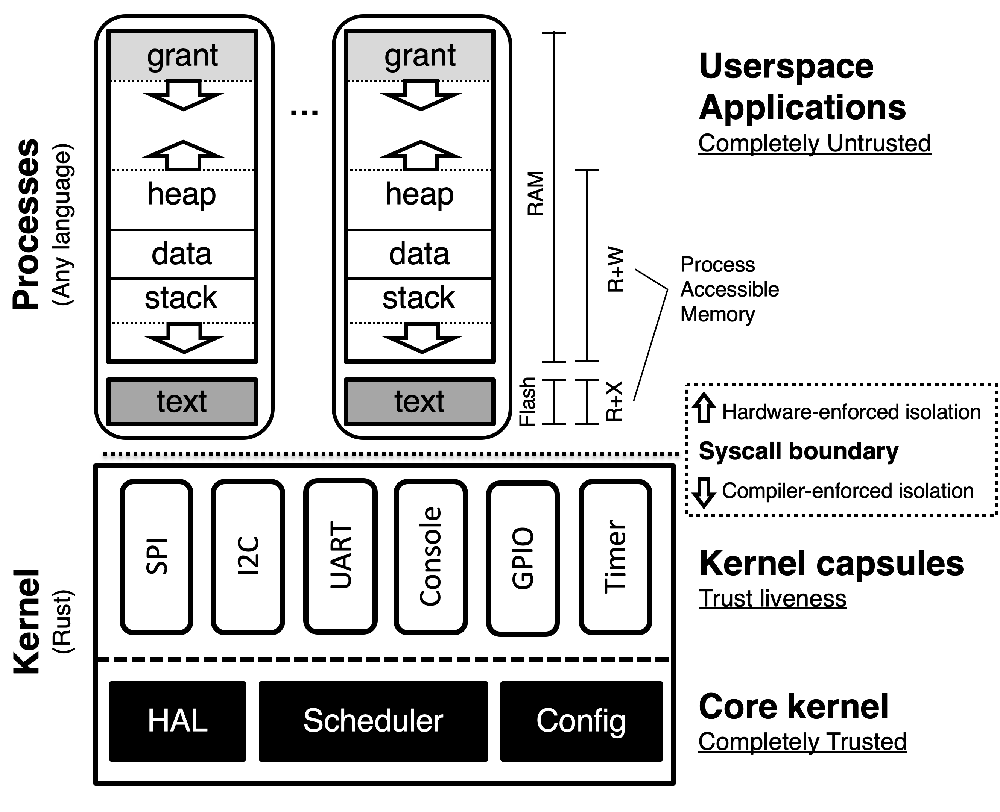

Tockの設計
===========

<!-- npm i -g markdown-toc; markdown-toc -i Design.md -->

<!-- toc -->

- [Tockの設計](#tockの設計)
  - [アーキテクチャ](#アーキテクチャ)
    - [カプセル](#カプセル)
    - [プロセス](#プロセス)
      - [メモリレイアウト](#メモリレイアウト)
    - [グラント](#グラント)
  - [カーネル設計原理](#カーネル設計原理)
    - [HILの役割](#hilの役割)
    - [スプリットフェーズ操作](#スプリットフェーズ操作)
    - [外部依存なし](#外部依存なし)
    - [`unsafe`とケイパビリティの使用](#unsafeとケイパビリティの使用)
    - [使用と理解の容易さ](#使用と理解の容易さ)
    - [実証済みの機能](#実証済みの機能)
    - [積極的にマージ、臆することなくアーカイブ](#積極的にマージ臆することなくアーカイブ)

<!-- tocstop -->

ほとんどのオペレーティングシステムは、プロセスなどの抽象化を使いコンポーネント間の隔離を
提供しています。各コンポーネントには他のコンポーネントがアクセスできない独自の（スタック、
ヒープ、データ用の）システムメモリが与えられます。プロセスが優れているのは、隔離と並行処理
の双方に便利な抽象化を提供するからです。しかし、1MB以下のメモリしか持たないマイクロ
コントローラのようなリソースに制約のあるシステムでは、このアプローチは、隔離の粒度と
リソース消費の間にトレードオフの関係を導きます。

Tockのアーキテクチャは、コンポーネントの隔離には言語サンドボックスを、カーネルの並行
処理には協調スケジューリングモデルを、各々使用することで、このトレードオフを解決します。
その結果、隔離は（多かれ少なかれ）リソース消費という面では自由になっていますが、
プリエンプティブなスケジューリングが犠牲になっています（つまり、悪意のあるコンポーネント
は、例えば無限ループでスピンすることによりシステムをブロックすることができます）。

第一に、カーネル内のコンポーネントを含む、Tockのすべてのコンポーネントは互いを
信用していません。カーネル内ではメモリや計算のオーバーヘッドを発生しない_カプセル_と
呼ばれる言語ベースの隔離抽象化によりこれを実現しています。ユーザ空間では、Tockは伝統的な
プロセスモデルを（多かれ少なかれ）使用しており、プロセスはハードウェア保護機構を使用して
カーネルや他のプロセスから隔離されています。

さらに、Tockは他の組み込みシステム特有の目標を念頭に置いて設計されています。Tockは
システムの全体的な信頼性を重視し、バグが発生した場合にはシステムの進行を妨げるような
コンポーネントを抑制します (可能であれば停止します)。

## アーキテクチャ

Tockには3つのアーキテクチャコンポーネントがあります。一つは、Rustで書かれた小さな信頼
できるカーネルであり、ハードウェア抽象化層(HAL)、スケジューラ、プラットフォーム固有の
設定を実装しています。その他のシステムコンポーネントは、2つの保護機構の一つで実装されて
おり、**カプセル**はカーネルと一緒にコンパイルされ、安全のためにRustの型とモジュール
システムを使用し、**プロセス**は実行時の保護のためにMPUを使用します。

システムコンポーネント（アプリケーション、ドライバ、仮想化レイヤなど）は、カプセル
またはプロセスのいずれかに実装することができますが、それぞれのメカニズムは、並行処理と
安全性において、メモリ消費量、パフォーマンス、粒度に関するトレードオフがあります。

| カテゴリ                | カプセル      | プロセス        |
| ---------------------- | ----------- | -------------- |
| 保護                    | 言語    | ハードウェア       |
| メモリオーバヘッド        | なし        | 独立したスタック |
| 保護の粒度               | 細かい        | 粗い         |
| 並行処理                 | 協調的 | プリエンプティブ     |
| 実行時更新               | いいえ          | はい            |

結果として、それぞれが異なるコンポーネントの実装に適しています。一般に、ドライバや仮想化
レイヤはカプセルとして実装され、ネットワークスタックなどの既存のコード/ライブラリを
使用するアプリケーションや複雑なドライバはプロセスとして実装されます。

### カプセル

カプセルは、Rustの構造体と関連する関数です。カプセルは直接相互に作用し、公開フィールドに
アクセスしたり、他のカプセルの関数を呼び出したりします。信頼できるプラットフォーム設定
コードがカプセルを初期化し、必要とする他のカプセルやカーネルリソースへのアクセスを可能に
します。カプセルは、特定の関数やフィールドをエクスポートしないことで内部状態を保護でき
ます。

カプセルはカーネル内部で特権ハードウェアモードで実行されますが、Rustの型とモジュール
システムは、バグや悪意のあるカプセルからコアカーネルを保護します。型安全性とメモリ安全性
はコンパイル時に適用されるため、安全性に関連するオーバーヘッドはなく、カプセルに必要な
エラーチェックは最小限です。たとえば、カプセルは参照の有効性をチェックする必要がありま
せん。参照が存在すれば、それは正しい型の有効なメモリを指しています。コンポーネントの分割
によるオーバーヘッドが実質的にないため、非常に細かい粒度の隔離が可能になります。

Rustの言語レベルの保護は強力な安全性を保証します。カプセルがRustの型システムを破壊
できない限り、カプセルは明示的に与えられたリソースにしかアクセスできず、そのリソースが
公開しているインターフェースにより許可された方法でしかアクセスできません。ただし、
カプセルはカーネルと同じシングルスレッドのイベントループで協調的にスケジュールされる
ため、システムの生存のためには信頼できるものでなければなりません。カプセルがパニックに
陥ったり、イベントハンドラに復帰しなかったりすると、システムは再起動することでしか回復
できません。

### プロセス

プロセスはカーネルから隔離された独立したアプリケーションであり、カーネルとは別の実行
スレッドで削減された権限で実行されます。カーネルはプロセスをプリエンプティブに
スケジュールするので、プロセスはカプセルよりも強くシステムの生存を保証します。さらに、
実行時にプロセスの隔離を強制するためにハードウェア保護を使用します。これにより、
プロセスは任意の言語で記述でき、実行時に安全にロードすることができます。

#### メモリレイアウト

プロセスは、ハードウェアメモリ保護ユニット (MPU) により、他のプロセスやカーネル、
基盤となるハードウェアから明示的に隔離されています。MPUはプロセスがアクセスできる
メモリアドレスを制限します。プロセスが許可された領域外にアクセスするとフォールトと
なり、カーネルトラップを発生させます。

フラッシュに格納されているコードは、読み取り専用のメモリ保護領域でアクセス可能になります。
各プロセスはRAM上の連続した領域が割り当てられてます。プロセスのこれまでにない点として、
アドレス空間の先頭に「グラント」領域が存在することが挙げられます。これは、メモリ保護
領域によりカバーされたプロセスに割り当てられたメモリであり、プロセスは読むことも
書くこともできません。グラント領域は（後述しますが）システムコールに応じて生存と安全性を
確保するためにカーネルがプロセスからメモリを借りられるようにするために必要となります。

### グラント

カプセルは動的にメモリを割り当てることができません。カーネル内での動的な割り当ては、
メモリが枯渇するか否かの予測を困難にするからです。単一カップセルによる不十分なメモリ
管理はカーネルの残りの部分のエラーの原因となります。さらに、単一のスタックを使用するので、
カーネルはカプセルのエラーから簡単に回復することができません。

しかし、カプセルはプロセスの要求に応じて動的にメモリを割り当てる必要があることがよく
あります。たとえば、仮想タイマードライバは、プロセスが作成する新たなタイマーごとに
メタデータを保持するために構造体を割り当てなければなりません。そのため、Tockは
リクエストを行うプロセスのメモリからカプセルが動的に割り当てることを可能にしています。

しかし、カプセルがプロセスメモリへの参照を直接保持することは安全ではありません。
プロセスはクラッシュし、動的にロードされる可能性があるので、カーネルコード全体にわたる
明示的なチェックを行わなければ、プロセスメモリへの参照が未だに有効であることを保証する
ことはできません。

カプセルがプロセスから安全にメモリを割り当てるためには、カーネルは次の3つの属性を強制
しなければなりません。

   1. 割り当てられたメモリはカプセルが型システムを破ることを許さない。

   2. カプセルはプロセスが生きている間だけプロセスメモリへのポインタにアクセスできる。

   3. カーネルは、終了したプロセスからメモリを取り戻すことができなければならない。

Tockは、メモリグラントを通じてこれら3つの要件を満たす安全なメモリ割り当て機構を提供
します。カプセルはカプセルと相互作用するプロセスのメモリから任意の型のデータを割り
当てることができます。このメモリはグラントセグメントから割り当てられます。

allowを介して渡されるバッファと同様に、グラントメモリへの参照は逆参照をする前に
プロセスがまだ生きていることを保証する型安全な構造体でラップされます。カプセル内の
バッファ型にしかなることができない共有バッファとは異なり、グラントメモリは任意の型
として定義することができます。そのため、プロセスはこのメモリにアクセスできません。
そうすることは型安全性を破ることになるからです。

## カーネル設計原理

Tockの目標を達成し、ハードウェア間での移植性を促進し、持続可能なオペレーティング
システムを保証するために、時がたつにつれ、Tockカーネルのための設計原理が現れてきました。
これらはカーネルへの新たな貢献が維持しなければならない一般原理です。しかし、これらの
原理はTockの開発によりわかってきたものであり、TockとRustのエコシステムの進化に
合わせて進化し続けるでしょう。

### HILの役割

一般的に、Tockカーネルは次の3つのレイヤーで構成されています。

1. チップ固有のドライバ。通常、これらのドライバは`chips`サブディレクトリにある
   クレートか、別のリポジトリにある同等のクレートにあります（たとえば、Titanポートは
   ツリーの外にありますが、その`h1b`クレートはこれと同等です)。これらのドライバは、
   特定のマイクロコントローラのハードウェアに固有の実装を持っています。理想的には、
   それらの実装はきわめてシンプルであり、単に共通のインタフェース（HIL）に従うだけ
   です。必ずしもそうとは限りませんが、それが理想です。

2. チップ非依存でポータブルなペリフェラルドライバとサブシステム。通常、これらは
   `capsules`クレートにあります。これらには、仮想アラームや仮想I2Cスタックのような
   ものや、チップ内には存在しないハードウェアペリフェラル（センサ、ラジオなど）用の
   ドライバが含まれます。通常、これらのドライバはHILを介してチップ固有のドライバに
   依存します。

3. システムコールドライバ。通常、これも`capsules`クレートにあります。これらは、
   システムコールインタフェースのある一部を実装するドライバであり、(2)よりもさらに
   ハードウェアから抽象化されていることが多いです。たとえば、温度センサシステム
   コールドライバは、ポータブルペリフェラルドライバとして実装されているものを含め、
   任意の温度センサを使用することができる。

   システムコールインタフェースは、様々な方法で実装できるもう一つの標準化のポイントです。
   そのため、全く異なるハードウェアスタックを使用する、その結果、全く異なるHILやチップ
   固有のドライバを使用する同一のシステムコールインタフェースの実装が複数存在することは
   完全に合理的です（たとえば、USB経由で動作するコンソールドライバは、USBをUART HIL
   に合わせようとするのではなく、同じシステムコールを実装する別のシステムコールドライバ
   として実装することができるでしょう）。

その重要性から、これらのレイヤー間のインターフェースはTockの設計と実装の最重要な部分と
なっています。これらのインターフェースはTockのハードウェアインターフェースレイヤ
（HIL）と呼ばれています。HILはRustのトレイとのポータブルコレクションであり、ボータブル
にも、非ポータルにも実装することができます。HILの非ポータブルな実装の例としては、特定の
チップのカウンタレジスタと比較レジスタで実装されたアラームがあり、ポータブルな実装の例と
しては、一つのアラームの上に複数のアラームを多重化する仮想化レイヤがあります。

HILは、一緒に使用することを意図した1つ以上のRustトレイトで構成されています。中には
HILのトレイトのサブセットの実装だけで良いケースもあります。たとえば、アナログデジタル
変換（ADC）HILは、単一サンプルとストリームサンプルという2つのトレイを持つことがで
ある実装では単一サンプルのみをサポートし、ストリーミングトレイトを実装しないことが
ことができます。場合があります。

HILインターフェースの選択はきわめて重要であり、従うべきいくつかの一般原則があります。

1. HILの実装はできる限り一般的なものであるべきです。さまざまなハードウェアを通じて
   あまりうまく動作しないインターフェースであるとしたら、おそらくそれは間違った
   インターフェースです。それは、高レベルすぎるか、低レベルすぎるか、あるいは、ただ
   柔軟性にかけるものです。一般的に、HILは特定のアプリケーションやハードウェアに
   最適になるように設計されるべきではありませんし、特定のアプリケーションとハード
   ウェアの組み合わせに最適化されるべきではありません。それが本当に必要な場合には、
   ドライバをチップやボードに特化させ、HILをまったく使用しないことができます。

   ある便利なインターフェースに関して、ネイティブで提供できるチップもあれば、必要な
   ハードウェアサポートはないが、何からの方法でその機能をエミュレートできるチップが
   ある場合もあります。このような場合、TockはHILに「高度な」トレイトを使用します。
   これは、HILのすべての実装者がその機能を実装する必要はなく、あるチップでより洗練
   された機能を公開することを可能にするものです。たとえば、UART HILには`ReceiveAdvanced`
   トレイトがありますが、このトレイトにはバイト中に一時停止が検出されるまでUART上の
   バイトを受信する特別な関数`receive_automatic()`があります。この関数はSAM4L
   ハードウェアでは直接サポートされていますが、タイマとGPIO割り込みを使用して
   エミュレートすることも可能です。これを高度なトレイトに含めることにより、カプセルは
   このインターフェースを使用することができますが、必要な機能を持たない他のUART実装は
   それを実装する必要がありません。

2. HILの実装は、それがデバイスが使用される唯一の方法であると仮定できます。その結果、
   Tockは特定のサービスや抽象化のために複数のHILを持つことを避けようとします。一般に、
   カーネルは同じデバイスに対して複数のHILを使用して同時にサポートすることはできない
   からです。たとえば、わずかに異なるAPIを持つUART用に2つの異なるHILがあるとします。
   それぞれのHILに対するチップ固有の実装では、ハードウェアレジスタの読み書きや
   割り込み処理を行う必要があるため、同時には存在することはできません。HILがデバイスを
   使用する唯一の方法であると仮定することで、将来起きる可能性のある矛盾やユースケースを
   心配することなく、TokcはHILのセマンティクスを正確に定義することが可能になります。

### スプリットフェーズ操作

Tockではプロセスはタイムスライスされ、プリエンプションされますが、カーネルはそうでは
ありません。すべてのプロセスはRun-to-completionです。これは重要な設計上の選択であり、
これによりカーネルが多くのタスクのために多くのスタックを割り当てることを避けることができ、
静的変数やその他の共有変数についてより単純に推論することが可能になるからです。

したがって、Tockカーネル内のすべてのI/O操作は非同期かつノンブロッキングです。メソッド
コールは操作を開始して直ちに戻ります。操作が完了すると、操作を実装している構造体が
コールバックをコールします。Tockはクロージャではなくコールバックを使用します。通常、
クロージャは動的メモリ割り当てを必要としますが、カーネルはこれを避け、一般にサポート
しないからです。

この設計はドライバの作成を複雑にします。一般的に、ブロッキングAPIの方が使いやすいから
です。しかし、これは個々のドライバの機能的な正しさ（エラーを誘発しやすいからであり、
正しく書けないからではありません）が発生しやすいからです)よりもカーネルの全体的な安全性
（たとえば、メモリ枯渇の回避や他のコードの実行独占の防止) を優先するための意識的な
選択です 。

カーネルが一時的にブロックできるケースは限られます。たとえば、SAM4LのGPIO
コントローラは、操作の間に準備が整うまでに最大5サイクルかかることがあります。技術的
には、完全に非同期のドライバであれば、操作は直ちに返り、処理が完了したらコールバックを
発行するというようにフェーズを分割することができます。しかし、コールバックを設定する
だけでも5サイクル以上かかるので、5サイクルスピンすることは単純なだけでなく、コストも
安くなります。そのため、この実装では返る前に数サイクルスピンするようにしてあります。
つまち、操作は同期的です。しかし、これらのケースはまれです。その操作は遅延中に他の
コードを実行させる価値がないほど高速でなければなりません。

### 外部依存なし

Tockはカーネル内のすべてのクレートで外部ライブラリを使用しないことを選択しています。
これは安全性を促進するです。これにより、Tockコードの監査にはTockリポジトリのコード
だけを検査すればよくなるからからです。Tockは`unsafe`の使用を非常に限定的なものに
しようとしており、それが使用される際にはその理由を明確にするようにしています。外部に
依存関係を持つと、特に外部ライブラリが進化するにつれて、`unsafe`の使用が正しいことを
保証することが明らかに困難になります。

しかし、外部ライブラリが非常に有用であることも認識しています。Tockの妥協点は
ライブラリの一部を`libraries`フォルダに取り込むことです。これにより、ライブラリの
ソースを同じリポジトリに置く一方で、ライブラリを明確に別のクレートして維持することに
なります。これを行う頻度は制限しようとしています。

将来的には、`cargo`やその他のRustツールによって、依存ライブラリの監査や管理が非常に
簡単になることを期待しています。たとえば、今のところ、cargoは依存ライブラリが`unsafe`を
使用している場合にエラーを発生させる機構を持っていません。依存コードが安全であることを
保証するための新しいツールが登場すれば、Tockは外部依存ライブラリを活用できるように
なるでしょう。

### `unsafe`とケイパビリティの使用

Tockはカーネルにおける`unsafe`コードの量を最小限にしようとしています。もちろん、
カーネルが行わなければならない操作の中には、Rustのメモリ安全保証を根本的に破る
ものが多数あります。これらの操作を区分化し、最終的に安全な方法で使用する方法を説明
しようとしています。

Rustの安全性に違反する操作に対して、Tockは関数、構造体、トレイトに`unsafe`として
マークします。これはこれらの要素を使用できるクレートを制限します。一般的に、Tockは
安全でない操作がどこで発生しているかを明確にするために、`unsafe`キーワードを付ける
ことを要求しています。たとえば、メモリマップド入出力(MMIO)レジスタにおいて、任意の型を
そのレジスタを表す構造体へキャスティングすることは、レジスタマップとアドレスが正しい
ことが検証されない限りメモリの安全性を破ります。このことを示すために、キャストを行う
ことは`unsafe`であると明示されています。しかし、キャストが完了すれば、これらの
レジスタにアクセスすることはメモリの安全性を破ることはありません。したがって、
レジスタの使用には`unsafe`キーワードは必要ありません。

しかし、潜在的に危険なすべてのコードがRustの安全モデルに違反するわけではありません。
たとえば、ボード上で実行中のプロセスを停止させることは言語レベルの安全性には違反
しません。しかし、セキュリティとシステムの信頼性の観点からは問題のある操作である
可能性があります。必ずしもすべてのカーネルコードが任意のプロセスを停止できるように
するべきではないからです（特に、信頼できないカプセルはこのAPIに対してこれができる
ようにするべきではありません）。これらのタイプの関数へのアクセスを制限する一つの方法は、
`unsafe`機構を再利用することでしょう。`unsafe`の使用を制限されているコードが
`unsafe`関数を実行しようとした場合、cargoが警告を発するからです。しかし、これは
`unsafe`の使用を混乱させ、コードが潜在的に安全性に違反しているのか、それとも制限された
APIであるかを理解することが困難になります。

Tockではこの代わりに重要なAPIへのアクセスを制限する[ケーパビリティ](Soundness.md#capabilities-restricting-access-to-certain-functions-and-operations)を
使用します。そのため、カーネル内の公開APIであっても、他のコードがそれらを使用できる
ことが非常に制限されているものは、その関数シグネチャに特定のケイパビリティを必要と
するべきです。これにより、明示的にケイパビリティを付与されていないコードが保護された
APIを呼び出すことを防ぐことができます。

最小特権の原則を促進するために、ケイパビリティは比較的細かく設定されており、特定の
APIへのアクセスを狭くしています。これは一般的に新たなAPIは新たなケイパビリティを
定義する必要があることを意味します。

### 使用と理解の容易さ

可能な限り、Tockの設計は新規ユーザや開発者がTockを理解して利用するための障壁を
低くするように最適化されています。これは、パフォーマンスよりも読みやすさや分かりやすさを
優先した設計を意図的に選択していることもあることを意味します。

例として、Tockは通常、Rustの[features](https://doc.rust-lang.org/1.0.0/book/conditional-compilation.html)や`#[cfg()]`属性を使用した条件付きコンパイルの使用を
避けています。一連のfeaturesの使用はカーネルを構築する際にどのコードを含めるべきかを
正確に最適化することにつながりますが、featuresに慣れていないユーザにとって、いつどの
featuresを有効にするかの決定は非常に難しいものなります。おそらく、このようなユーザは
デフォルトの設定を使用するので、featuresを利用する利点を減らすことになるでしょう。
また、条件付きコンパイルは、featuresにより実行されているコードが大幅に変わるため、
特定のボードで実行中のカーネルのバージョンを正確に理解することが非常に困難になります。
最後に、デフォルト以外のオプションは、デフォルトの設定ほど十分にテストされている可能性が
低く、利用できないカーネルのバージョンになる可能性があります。

Tockはまた、Tockがユーザにとって「すぐに動く」ことを保証しようとしています。これは、
Tockを動作させるための手順を最小限にしようとしていることからも明らかです。ビルド
システムには多くの開発者にお馴染みの`make`を使用しており、ボードフォルダで`make`を
実行するだけでカーネルがコンパイルされます。最もサポートされているボード（Hailと
imix）では`make program`を実行するだけでプログラムすることができます。アプリを
インストールするにはもう一つのコマンド`tockloader install blink`を実行するだけ
です。Tockloaderは今後もTockの使いやすさをサポートするために拡張を続けていきます。
現在のところ、Tockの「すぐに動く」という設計目標は完全には達成されていません。
しかし、今後の設計上の決定はTockが「すぐに動く」ことを促進するようにし続ける必要が
あります。

### 実証済みの機能

Tockは明確なユースケースが確立されていない限り、カーネルに機能を追加することは
ありません。たとえば、赤黒木の実装を`kernel/src/common`に追加することは、将来的に
Tockの新機能に役立つかもしれません。しかし、赤黒木を必要とする動機となるような
カーネル内部のユースケースがなければそれがマージされることはないでしょう。この一般的な
原則は、プルリクエストの新たな機能を評価するための出発点を提供します。

また、ユースケースを必要とすることで、他の内部カーネルAPIが変更されたときに更新される
だけでなく、コードがテストされたり、使用されたりする可能性が高くなります。

### 積極的にマージ、臆することなくアーカイブ

学術研究をルーツに持つ実験的な組み込みオペレーティングシステムとして、Tockは、新規の、
リスクの高い、実験的な、あるいは焦点の絞られたコードの貢献を受ける可能性が高く、
それらは Tockの長期的な成長に役立つかもしれませんし、そうでないかもしれません。
新しい実験的なコードのために"hold"や"contributions"リポジトリを使うのではなく、
Tockは新しい機能をTockの本流にマージしようとします。これはコードのメンテナンス負担を
軽減し（ツリー外でメンテナンスする必要がない）、機能をより目に見える形にすることが
できます。

しかし、すべての機能が受け入れられたり、完成したり、有用性が証明されたりするわけではなく、
コードをTockの本流に置くことが全体的なメンテナンス負担になることもあります。このような
場合、Tockはコードを[アーカイブリポジトリ](https://github.com/tock/tock-archive/)に移動します。
