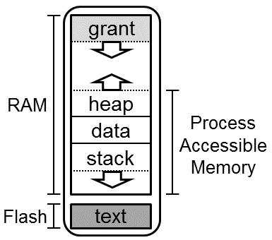

メモリ隔離
=============

このドキュメントでは、カーネルとプロセスのアクセス許可の観点から、Tockでメモリが
どのように隔離されているかを説明します。これを読む前に、[Tockの設計](Design.md)と
[Tockのメモリレイアウト](Memory_Layout.md)を十分に理解していることを確認して
ください。

<!-- npm i -g markdown-toc; markdown-toc -i Memory_Isolation.md -->

<!-- toc -->

- [メモリ隔離](#メモリ隔離)
  - [プロセスの隔離](#プロセスの隔離)
    - [Flash](#flash)
    - [RAM](#ram)

<!-- tocstop -->

メモリの隔離はTockの重要な属性です。これがなければ、プロセスはメモリの任意の部分に
アクセスすることができ、システム全体のセキュリティが損なわれてしまいます。その理由は、
Rustはコンパイル時にメモリの安全性（二重解放やバッファオーバーフローがないなど）と
型の安全性を守りますが、どの言語でも記述可能なプロセスが、メモリ内のアクセスしては
いけないアドレスにアクセスすることを防ぐことはできないからです。このようなことが
起きないようにするためには何らかの別のコンポーネントが必要であり、さもないと
システムは信頼できないプロセスを安全にサポートすることができません。

信頼できないアプリケーションをサポートするために、Tockは多くの組み込みマイクロ
コントローラに搭載されているメモリ保護ユニット（MPU）を使用しています。MPUは
特定のメモリ領域にアクセス許可を設定できるハードウェアコンポーネントです。これらの
メモリ領域には、読み取り（R）、書き込み（W）、実行（X）の3つの基本的なアクセス型を
設定することができます。フルアクセスとは、特定のメモリ領域で3つのアクセス型が
すべて許可されていることを意味します。

プロセスはデフォルトで互いのメモリへのアクセスを許可されていないので、MPUは、プロセスが
フラッシュのどこに格納されているか、および、どのメモリが割り当てられているかに基づいて、
各プロセスを設定しなければなりません。つまり、MPUの設定はプロセスごとに異なります。
したがって、ユーザランドプロセスにコンテキストを切り替えるたびに、Tockはそのプロセス用
にMPUを再構成します。

システムがカーネルコードを実行しているときは、MPUは無効になっています。これは、
カーネルがアドレス空間全体にアクセスすることを妨げるハードウェア上の制限がないことを
意味します。カーネルができることはRustの型システムによって制限されています。たとえば、
カプセル（`unsafe`を使用できません）はプロセスのメモリにアクセスできません、任意の
ポインタを作成することも逆参照することもできないからです。一般に、Tockは信頼できる
コード（すなわち、`unsafe`を呼び出せるコード）の量を最小限に抑え、`unsafe`を必要と
するコードをカプセル化して、そのコードが何をするのか、システム全体の安全性を侵害しない
方法でそれをどのように使うのかを明確にしようとしています。

## プロセスの隔離

アーキテクチャの観点から見ると、プロセスはバグのある、悪意さえあるかもしれない任意の
コードであると考えられます。そのため、Tockでは、アプリケーションの動作不良がシステム
全体の整合性を損なわないように注意を払っています。

### Flash

フラッシュは、マイクロコントローラ上の不揮発性メモリ空間です。一般にプロセスは
フラッシュ内の任意のアドレスにアクセスすることはできず、ブートローダやカーネル
コードにアクセスすることは絶対に禁止されています。また、他のプロセスの不揮発性
領域を読み書きすることも禁止されています。

プロセスはフラッシュ内の各自のメモリにはアクセスできます。Tock Binary Format（TBF）
ヘッダとヘッダの後の保護領域を含む特定の領域は読み取り専用になっています。カーネルが
ヘッダの整合性を保証できなければならないからです。中でも、カーネルはフラッシュ内の次の
アプリを見つけるためにアプリの合計サイズを知る必要があります。また、カーネルはアプリを
変更することができないようにするためにアプリに関する不揮発性の情報（たとえば、Failure
状態に何回入ったかなど）を保存したい場合もあるかもしれません。

アプリの残りの部分、特にアプリの実際のコードは、アプリが所有していると考えられます。
アプリは自身のコードを実行するためにフラッシュを読むことができます。MCUがその不揮発性
メモリにフラッシュを使用している場合、アプリが自身のフラッシュ領域を直接変更することが
できない可能性が高くなります。通常、フラッシュは消去したり書き込んだりするために何らかの
ハードウェアペリフェラルとの相互作用を必要とするからです。この場合、アプリは自身の
フラッシュ領域を変更するためにカーネルのサポートが必要になります。

### RAM

プロセスRAMは実行中のすべてのアプリ間で分割されるメモリ空間です。下図はプロセスの
メモリ空間を示しています。

プロセスは自身のRAM領域にはフルアクセスできます。グラント領域と呼ばれるRAM領域の
セグメントはプロセスではなくカーネルの使用専用に予約されています。グラント領域には
カーネルのデータ構造体が含まれているためプロセスはこの領域を読むことも書くことも
できません。

プロセスのメモリ領域の残りの部分は、プロセスが適切と判断した通りにスタックやヒープ、
データセクションとして使用することができます。プロセスはこれらの使用方法を完全に
制御します。スタックとヒープをどこに置いたかをカーネルに知らせるためにプロセスが
使用できるできる`mem`システムコールがありますが、これらは完全にデバッグ用です。
通常操作のためにプロセスがどのようにメモリを組織化しているかをカーネルが知る必要は
ありません。

プロセスは`allow`システムコールを使って自身のRAMの一部をカーネルと共有することを
明示的に選択することができます。これによりカプセルは特定の操作で使用するための
プロセスのメモリへの読み書きアクセスが可能になります。

プロセスは、[プロセス間通信（IPC）機構](https://book.tockos.org/tutorials/05_ipc.html)により
相互に通信することができます。IPCを使用するには、プロセスは共有バッファとして使用する
ためにRAM内のバッファを指定し、このバッファを他のプロセスと共有したい旨をカーネルに
通知します。すると、このIPC機構を使う他のユーザがこのバッファを読み書きすることが
許されます。IPC以外ではプロセスは他のプロセスのRAMを読むことも書くこともできません。
