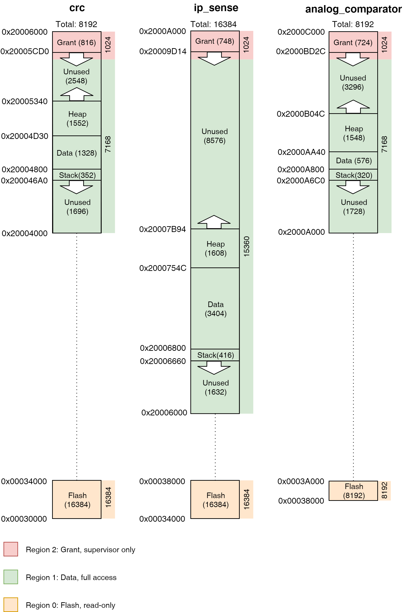

メモリレイアウト
=============

このドキュメントでは、Tockにおいてメモリがどのように構造化され、カーネルや
アプリケーション、状態のサポートのために使用されているかを説明します。

<!-- npm i -g markdown-toc; markdown-toc -i Memory_Layout.md -->

<!-- toc -->

- [メモリレイアウト](#メモリレイアウト)
  - [Flash](#flash)
    - [カーネルコード](#カーネルコード)
    - [プロセスレコード](#プロセスレコード)
  - [RAM](#ram)
    - [カーネルRAM](#カーネルram)
    - [プロセスRAM](#プロセスram)
  - [ハードウェア実装](#ハードウェア実装)
    - [SAM4L](#sam4l)
      - [Flash](#flash-1)
      - [RAM](#ram-1)
      - [概要](#概要)

<!-- tocstop -->

Tockは、一つのアドレス空間に不揮発性のFlashメモリ（コード用）とRAM（スタックと
データ用）を持つCortex-Mのようなマイクロコントローラ上で動作することを意図しています。
Cortex-Mアーキテクチャはアドレス空間の高レベルなレイアウトを規定していますが、Tockの
正確なレイアウトはボードによって変えることができます。ほとんどのボードは単純にFlash
とSRAMの開始と終了を`layout.ld`ファイルで定義し、[汎用のTockメモリマップ](../boards/kernel_layout.ld)を
インクルードしています。

## Flash

不揮発性のflashメモリはカーネルコードおよびすべての[プロセスコード](TockBinaryFormat.md)の
リンクリストを格納します。

### カーネルコード

カーネルコードは2つの主要な領域に分割されます。一つは`.text`であり、ベクタテーブルと
プログラムコード、初期化ルーチン、その他の読み取り専用データを格納します。このセクションは
flashの先頭に書き込まれます。

`.text`領域に続く2番目の主要領域は`.relocate`領域です。これはSRAMに存在する必要が
あるが、非ゼロの初期値を持ち、Tockが初期化の一環としてflashからSRAMにコピーする値を
格納します（[起動](Startup.md)を参照してください）。

### プロセスレコード

プロセスは`_sapps`というシンボルを使ってカーネルから取得できる既知の開始アドレスから
flashに配置されます。各プロセスはTock Binary Format (TBF) ヘッダから始まり、
実際のアプリケーションバイナリが続きます。プロセスはflash内で連続的に配置され、
各プロセスのTBFヘッダにはflash内におけるプロセス全体のサイズが含まれています。
これによりカーネルがアプリを走査するために使用する連結リスト構造を作成します。
有効なプロセスの終了は不正なTBFヘッダによって示されます。通常、有効な最後のプロセスの
後のflashページにはすべて0x00か0xFFがセットされます。

## RAM

RAMはカーネルとプロセスの両者により現在使用されているデータを格納します。

### カーネルRAM

カーネルRAMには3つの主要な領域があります。

1. カーネルスタック.
2. カーネルデータ: 起動時にflashからコピーされた、初期化メモリ。
3. カーネルBSS: ブート時にゼロ詰めされた未初期化メモリ。

### プロセスRAM

プロセスRAMはすべての実行中のアプリケーションの間で分割されたメモリ空間です。

プロセスのRAMには4つの主要領域があります。

1. プロセススタック
2. プロセスデータ
3. プロセスヒープ
4. ぐたんと

次の図は一つのプロセスのメモリ空間を示したものです。

## ハードウェア実装

### SAM4L

SAM4LはHailとImixプラットフォームで使用されているマイクロコントローラです。
そのflashとRAMの構成は次のとおりです。

#### Flash

| アドレス範囲   | 長さ（バイト） | 内容    | 説明  |
|-----------------|----------------|------------|------|
| 0x0-3FF         | 1024           | ブートローダ | ブートローダ用にflashに予約済み。ベクタテーブルも。 |
| 0x400-0x5FF     | 512            | フラッグ      | フラッグ用に予約済みの空間。ブートローダが存在する場合、最初の14バイトは"TOCKBOOTLOADER"。 |
| 0x600-0x9FF     | 1024           | 属性 | ボードとその上で実行されるソフトウェアを記述する属性を示す最大16個のキー・バリューペア。   |
| 0xA00-0xFFFF    | 61.5k          | ブートローダ | カーネルとアプリケーションをプログラムする非JTAGの方法を提供するソフトウェアブートローダ。    |
| 0x10000-0x2FFFF | 128k           | カーネル     | カーネル用のflash空間。  |
| 0x30000-0x7FFFF | 320k           | アプリケーション | アプリケーション用のflash空間。|

#### RAM

| アドレス範囲   | 長さ（バイト） | 内容    | 説明  |
|-----------------|----------------|------------|------|
| 0x20000000-0x2000FFFF | 64k            | カーネルとアプリケーションのRAN | カーネルはすべてのRAMとリンクし、アプリケーションが使用するバッファを内部的に割り当てる。 |

#### 概要

以下の画像は、実際にどのように配置されるかの例を示しています。図では3つの
アプリケーション（crc, ip_sense, analog_comparator）が実行中の
flashとRAMの双方のアドレス空間を示しています。

